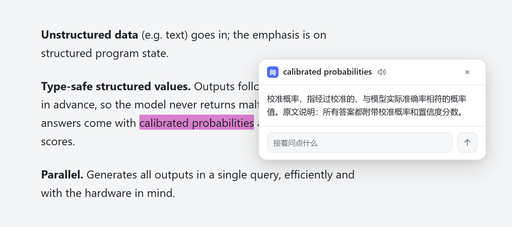
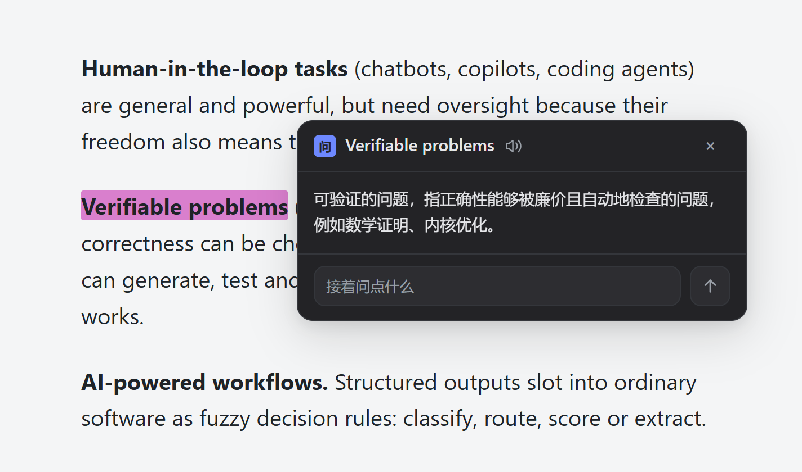

<div align="center">


# DeepSeek 伴读

**读到哪里，就在原文旁理解到哪里。**

简体中文 · [English](README.en.md)

[](https://github.com/zzkws/DeepSeek-Reading-Companion/releases/latest)




</div>

DeepSeek 伴读是一个 Chrome 扩展，陪你读英文网页和论文 PDF。选中一个词或一句话，DeepSeek 结合前后文，沿着原文给出直接的中文理解；有疑问就在同一张卡片里接着问，也可以听选中内容的英文发音。解释就在当前页面上，与选中的那一行同高，读完接着看下一行，不用在页面和聊天窗口之间来回切换。

## 特性

- **以原文为准**：沿用原文的对象、术语、主语和论述顺序，保留比较、限定与不确定性；先说选中内容的确切含义，再说原文明确建立的关系。用自然段落直说，不套词典栏目或固定模板。
- **就地追问**：卡片在当前页面展开，答案流式出现；追问沿用当前上下文和已有对话，原文与回答始终同屏。
- **选区自动补齐**：漏选半个单词时自动补到完整的词边界；PDF 里只选中跨行断词的一半，也能得到完整单词。
- **PDF 阅读器**：按栏与段落整理文字，合并跨行、跨页的断词，图注单独存放；使用 Flash 模型时，会把当前页和前面带图注的页面一起交给视觉模型，图表和公式也能对照着讲。
- **本地发音**：Kokoro Q8 美式 Heart 音色，模型约 92 MB，首次下载并校验后离线可用；可选「点发音按钮时再生成」或「选中文字时就提前生成」，音量可调，最多 240 个字符。
- **历史对话**：最近 200 条保存在本机，可以搜索，也能回到原文。
- **按你的习惯来**：模型（Flash / Pro）、触发方式（选中即弹出 / 按住 Alt 选中）、浮层位置（固定在右侧 / 贴着选区）、深度思考都可在设置里调；主题默认浅色，也可以跟随系统或固定为深色。

## 阅读场景

**一个术语，放回这一段。** 技术文章里的词未必难，难的是它在这一段里指什么。选中 `calibrated probabilities`，卡片先给出「校准概率」的含义，再说明它和原文所述答案的关系（见页首图）。

**顺着论述继续问。** 读到 `Verifiable problems`，单独翻出「可验证」还接不上文章。伴读沿着所在段落说明：这类问题的正确性可以低成本、自动地检查，原文举了数学证明与内核优化的例子。还想再问，直接在卡片底部输入。



## 环境要求

- Chrome 123 或更新版本
- 你自己的 [DeepSeek API Key](https://platform.deepseek.com/api_keys)（调用费用计入你的账户）

## 用 Claude Code 安装

如果你在用 [Claude Code](https://claude.com/claude-code)，点代码块右上角复制下面这段 prompt，原样粘贴给它即可。它会先审查源码，再从审查过的代码构建（没有 Node.js 时改用预构建安装包），然后一步步指导你在 Chrome 里加载、验证。API Key 由你自己填在扩展的设置页里，不会经过它。

```text
请帮我安装 Chrome 扩展「DeepSeek 伴读」（https://github.com/zzkws/DeepSeek-Reading-Companion）。它能在
英文网页和 PDF 上划词，用 DeepSeek 结合上下文给出中文解释，还能在本地发音。请按下面的步骤审查、准备，
并指导我装好它，过程中把你的发现告诉我。

1. 检查环境
   - 确认装了 Chrome 123 或更新版本，告诉我版本号。
   - 看看有没有 git 和 Node.js 22（`node --version`）。没有 Node.js 也可以，第 4 步会改用预构建的安装包。

2. 获取代码
   - 把仓库克隆到一个固定目录：Windows 用 %USERPROFILE%\DeepSeek-Reading-Companion，macOS / Linux 用
     ~/DeepSeek-Reading-Companion，除非我指定了别的位置。Chrome 会一直从这里加载扩展，以后不能删除或移动它。
   - 切到最新 Release 的标签（用 `gh release view` 或 GitHub 的 Releases 页面查，例如 v0.3.0）。

3. 安装前先审查代码
   - 读 `manifest.config.ts`，以及 `src/background`、`src/content`、`src/pdf`、`src/speech`、`src/shared`
     下的文件。
   - 核对它的行为是否和下面的清单一致；清单之外的任何行为（尤其是别的网络请求、统计上报、执行远程代码），
     先报告给我再继续：
     * 联网：只请求设置里的 API 地址（默认 https://api.deepseek.com）的 /chat/completions；发音模型从本项目的
       GitHub Release 下载，Hugging Face 作备用源，下载后做 SHA-256 校验；PDF 阅读器只有用 `?file=<网址>`
       打开时，才会去下载那份 PDF。
     * 发出的内容：选中的词句，加上从文章开头到选区之后约 1000 字的上下文（文章超过 16 万字时，只发开头
       1.2 万字和选区附近的内容）；用 Flash 模型查 PDF 时，附带最多 12 页的页图。
     * 本地存储：API Key、设置和最多 200 条历史在 chrome.storage.local；发音模型在 Cache Storage。
     * 权限：storage、offscreen、unlimitedStorage；内容脚本运行在所有 http(s) 页面的主框架里；
       host_permissions 只有 DeepSeek API，以及 Hugging Face 和 GitHub 的下载地址。
     * 不执行任何远程下载的 JavaScript 或 WebAssembly（见 manifest 里的 content_security_policy）。

4. 准备要加载的目录
   - 有 Node.js 22 时，从审查过的源码构建：`npm ci`，再 `npm run build`，要加载的目录就是 `dist`。这样装上的
     正是你审查过的代码。较新版本的 npm 可能提示一些依赖的安装脚本被拦截了，保持拦截即可，构建用不到它们；
     只有构建失败时才考虑放行，放行前先问我。
   - 没有 Node.js，或者构建失败，就从同一个 Release 下载 `deepseek-reading-companion.zip`，解压到仓库里的
     `release` 目录，要加载的就是它。这个安装包由 `.github/workflows/release.yml` 在 GitHub 上从同一个标签构建。
   - 确认目录里有 `manifest.json`，然后告诉我这个目录的完整路径。

5. 指导我加载（这一步要我自己在 Chrome 里点，你没法替我完成）
   - 让我打开 chrome://extensions，开启右上角的「开发者模式」，点「加载已解压的扩展程序」，选第 4 步的目录。
   - 设置页会自动打开。我会自己在那里填 DeepSeek API Key（https://platform.deepseek.com/api_keys），点「测试
     连接」（设置会自动保存）。不要让我把 Key 发给你，也不要把它写进任何文件。
   - 提醒我留在设置页，等发音模型下载完（约 92 MB）。

6. 验证
   - 请我打开任意一篇英文网页，选中一个词，确认页面右侧弹出了解释卡片；再点卡片标题旁的扬声器听发音。
   - 哪一步不对就帮我排查：先看 chrome://extensions 里这个扩展有没有报错，再看设置页的连接测试结果。

7. 交接
   - 给我讲清楚怎么用：直接选中就会弹出（如果设置成「按住 Alt 选中」，就按住 Alt 再选）；卡片底部可以追问，
     按 Enter 发送；Esc 关闭；读 PDF 要点工具栏图标打开「PDF 阅读器」，再把文件拖进去；工具栏图标里还有
     「历史对话」和「设置」。
   - 告诉我怎么升级：在仓库里 `git fetch --tags`，切到新的标签后重新构建（或下载新的安装包覆盖 `release`
     目录），然后在 chrome://extensions 里重新加载扩展，并刷新已经打开的页面。
   - 告诉我怎么卸载：在 chrome://extensions 里移除扩展，再删除整个目录。

不要修改项目代码；任何全局安装都要先问过我。
```

## 手动安装

1. 从[最新版本](https://github.com/zzkws/DeepSeek-Reading-Companion/releases/latest)下载 `deepseek-reading-companion.zip`，解压到一个固定的目录。
2. 打开 `chrome://extensions`，开启右上角的「开发者模式」，点「加载已解压的扩展程序」，选择解压后的目录。
3. 设置页会自动打开：填入 API Key，点「测试连接」确认可用。设置改动会自动保存。发音模型的下载进度也显示在这里。

升级时，用新文件替换原目录里的文件，在 `chrome://extensions` 里重新加载扩展，再刷新已经打开的阅读页面。

## 使用

| 想做的事 | 怎么做 |
| --- | --- |
| 解释网页上的词句 | 直接选中；设置成「按住 Alt 选中」时，按住 <kbd>Alt</kbd> 再选 |
| 读 PDF | 点工具栏图标 →「打开 PDF 阅读器」→ 把文件拖进去，然后照常划词 |
| 追问 | 在卡片底部输入，按 <kbd>Enter</kbd> |
| 听发音 | 点卡片标题旁的扬声器 |
| 关闭卡片 | <kbd>Esc</kbd> 或点 × |
| 找回查过的内容 | 工具栏图标 →「历史对话」 |
| 改设置 | 工具栏图标 →「设置」：API Key、API 地址、模型、深度思考、触发方式、主题、浮层位置、发音 |

Chrome 自带的 PDF 查看器拿不到选区，所以 PDF 要在扩展自己的阅读器里打开。

## 数据与隐私

- **发给 API 的内容**：选中的词句，以及理解它所需的上下文——从文章开头到选区之后约 1000 字，截到句子或段落边界；文章超过 16 万字时，改为发送开头 1.2 万字加选区附近的内容。用 Flash 模型查询 PDF 时，还会附上当前页和相关图表所在页的页图（最多 12 页）。目的地是设置里的 API 地址，默认 `https://api.deepseek.com`。
- **只存在本机的内容**：API Key 和对话历史保存在 `chrome.storage.local`，不会上传到别处。
- **发音**：Kokoro 模型从本项目的 GitHub Release 下载（Hugging Face 作备用源），经 SHA-256 校验后缓存；要读的文本只在本机处理。扩展不执行任何远程下载的 JavaScript 或 WebAssembly。
- **权限用途**：`storage` 存设置和历史；`unlimitedStorage` 保证发音模型缓存不被清理；`offscreen` 用于在后台生成语音；内容脚本运行在所有 http(s) 页面上，用来响应你的选区；主机权限只覆盖 DeepSeek API 和模型下载地址。

**已知限制**：扫描版 PDF 没有可选的文字层，暂时不能划词；复杂公式和表格需要对照原页核实；网页 iframe 里的选区暂不支持。

## 开发

需要 Node.js 22（与发布流程一致）。

```bash
git clone https://github.com/zzkws/DeepSeek-Reading-Companion.git
cd DeepSeek-Reading-Companion
npm ci
npm run build      # 类型检查 + 构建到 dist/
```

在 `chrome://extensions` 里加载生成的 `dist/` 即可调试。

| 命令 | 作用 |
| --- | --- |
| `npm run dev` | Vite 开发模式，改动自动重载 |
| `npm run typecheck` | 只做 TypeScript 类型检查 |
| `npm run zip` | 构建并打包成 `deepseek-reading-companion.zip` |
| `npm run icons` | 重新生成工具栏图标 |
| `npm run screenshots` | 用扩展真实的卡片组件重新渲染 README 截图（需要本机装有 Chrome） |

推送 `v*` 标签会触发 GitHub Actions，自动构建并发布 Release。PDF 文本整理和选区补齐的回归脚本在 `scripts/` 里，用法见 [docs/reading-pipeline.md](docs/reading-pipeline.md)。

```
src/
├─ background/   # Service Worker：组装提示词、调用 DeepSeek、流式返回
│  └─ prompt.ts  #   回答原则与上下文裁剪（完整系统提示词在这里）
├─ content/      # 网页内容脚本：正文提取、选区补齐、弹出卡片
├─ pdf/          # 扩展自带的 PDF 阅读器：版面整理、选区映射、页图
├─ ui/           # 卡片界面（Preact），网页与 PDF 共用
├─ speech/       # Kokoro 本地发音：模型缓存、离屏页与 Worker
├─ options/      # 设置页
├─ history/      # 历史对话页
├─ menu/         # 工具栏弹出菜单
└─ shared/       # 设置、历史、类型与选区工具
```

## 关于这个项目

DeepSeek 伴读是围绕 DeepSeek 模型能力与设计风格制作的独立开源作品，**不是 DeepSeek 官方产品**。谨以此作品，表达本人对 DeepSeek 的喜爱之情。

## 许可证

源码采用 [MIT 许可证](LICENSE)。本地发音用到的组件和模型保留各自的许可（Kokoro 为 Apache-2.0，内嵌的 eSpeak NG 为 GPL-3.0 等），详见[第三方许可说明](THIRD_PARTY_NOTICES.md)。
